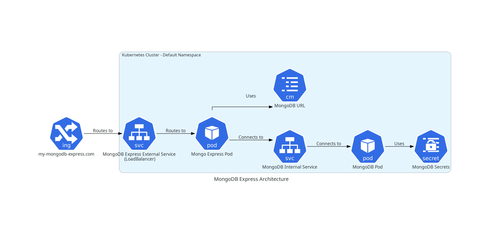

# Kubernetes Architecture for MongoDB and Mongo Express

## Introduction

This demo application showcases a Kubernetes architecture that includes the following components:

- Pods
- Services
- Deployments
- Ingress

The application demonstrates how a user can hit an external IP address, which allows the external Kubernetes service to communicate with the Mongo Express pod, which in turn connects to the internal MongoDB service, ultimately communicating with the MongoDB pod where the database resides.

## File Structure

The project contains the following YAML files:

- `mongo.yaml`: Configuration for the MongoDB deployment.
- `mongo-secret.yaml`: Secrets for MongoDB.
- `mongo-express.yaml`: Configuration for the Mongo Express deployment.
- `mongo-configmap.yaml`: Configuration map for MongoDB.

## Architecture Diagram

## Detailed Description

### 1. MongoDB Deployment (`mongo.yaml`)

This file contains the configuration for deploying the MongoDB pod. It specifies the container image, environment variables, and volume mounts required for MongoDB.

### 2. MongoDB Secrets (`mongo-secret.yaml`)

This file defines the secrets used by the MongoDB pod, including sensitive information such as passwords and credentials.

### 3. Mongo Express Deployment (`mongo-express.yaml`)

This file contains the configuration for deploying the Mongo Express pod. Mongo Express is a web-based MongoDB admin interface, making it easier to manage the MongoDB database.

### 4. MongoDB ConfigMap (`mongo-configmap.yaml`)

This file defines the configuration map for MongoDB. It contains non-sensitive configuration data that the MongoDB pod needs to function correctly.
